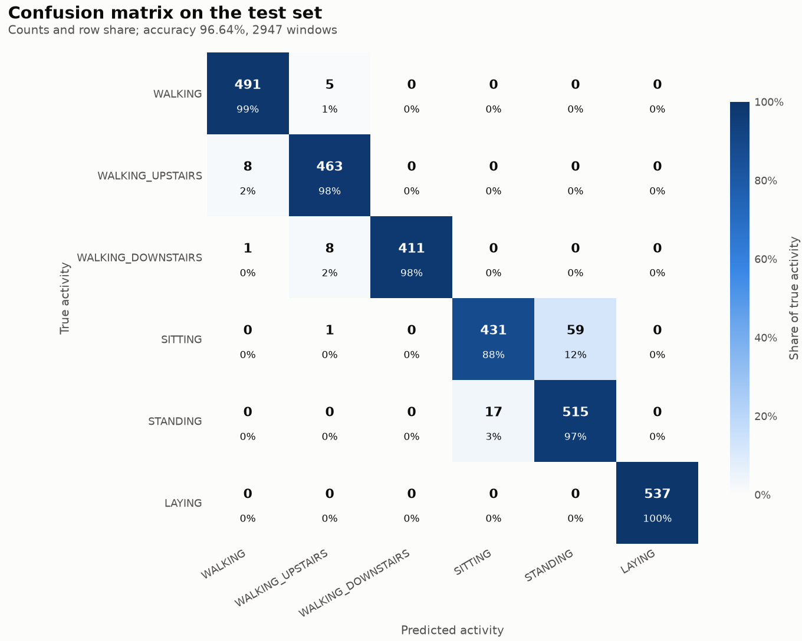
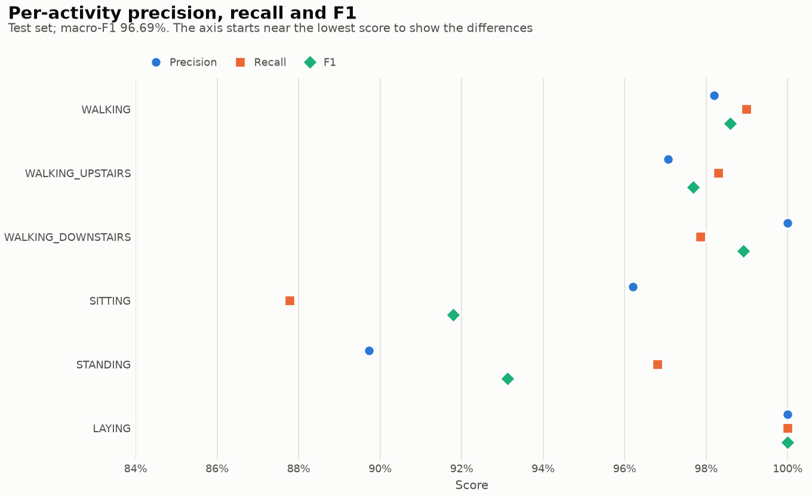
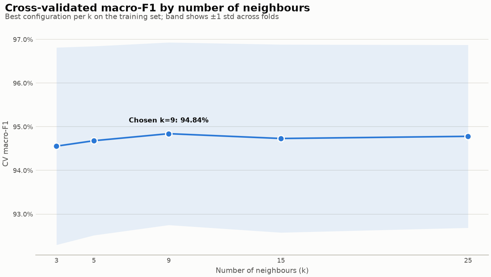
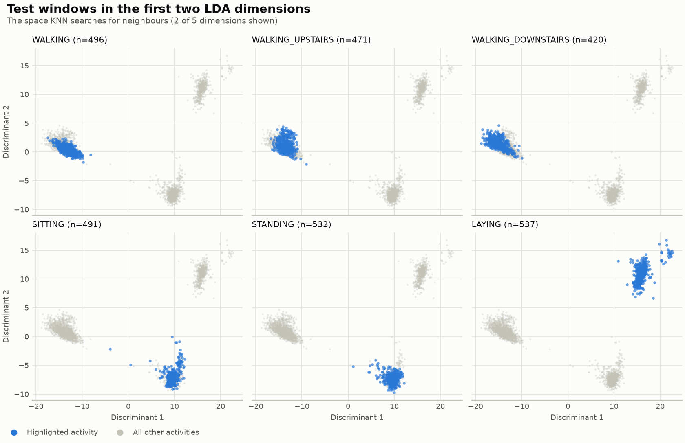

# knn-motion-inference

Human activity recognition from smartphone sensor data with a K-Nearest Neighbours classifier.

The model reads a window of accelerometer and gyroscope features and predicts one of six activities: walking, walking upstairs, walking downstairs, sitting, standing, or laying. It reaches **96.6% accuracy** on people it has never seen during training.

| Metric (held-out test set, 2,947 windows) | Value |
|---|---|
| Accuracy | **96.64%** |
| Macro-F1 | **96.69%** |
| Cross-validated macro-F1 (training set) | 94.84% |
| Saved model size | 0.85 MB |

## Contents

- [How it works](#how-it-works)
- [Results](#results)
- [Quick start](#quick-start)
- [Using the model](#using-the-model)
- [Project structure](#project-structure)
- [Development](#development)
- [Dataset](#dataset)
- [Roadmap](#roadmap)
- [License](#license)

## How it works

```
561 sensor features ──► LDA (5 dimensions) ──► KNN (k=9) ──► activity
```

1. **Linear Discriminant Analysis (LDA).** The 561 input features are heavily correlated. Plain KNN on all of them measures distance in a space where most directions carry no information about the activity. LDA is trained on the labels and projects every window onto the 5 directions that best separate the six activities.
2. **K-Nearest Neighbours.** A new window is classified by a vote of its 9 closest training windows in that 5-dimensional space.

The LDA step is what makes the model work. On the same test set:

| Model | Test accuracy |
|---|---|
| KNN on the raw 561 features | 90.6% |
| StandardScaler + KNN | 88.9% |
| PCA (95% variance) + KNN | 88.3% |
| **LDA + KNN** (this project) | **96.6%** |

Scaling and PCA both make things worse, because the features are already normalised to [-1, 1] and PCA keeps the directions with the most variance rather than those that best separate the activities.

### Honest model selection

Hyperparameters are chosen with cross-validation on the **training set only**. The test set is scored exactly once, after the model has been chosen.

The data comes in overlapping windows (50% overlap) recorded from the same people. With shuffled cross-validation, near-duplicate windows land on both sides of a split, and the score is inflated: shuffled CV reports 98.3% for a model that scores 96.4% on new people. The pipeline therefore uses **unshuffled folds**. The rows are ordered by person, so each fold roughly holds out a group of people. If subject ids are available, it switches to `GroupKFold` and holds out whole people exactly (see [Dataset](#dataset)).

The search covers 100 configurations, scored by macro-F1:

| Parameter | Values |
|---|---|
| LDA solver | `svd`; or `eigen` with shrinkage `auto`, 0.05, 0.1, 0.2 |
| Number of neighbours (k) | 3, 5, 9, 15, 25 |
| Neighbour weights | `uniform`, `distance` |
| Distance | Manhattan (p=1), Euclidean (p=2) |

## Results

Every training run writes these charts to [`knn/reports/`](knn/reports/).

### Confusion matrix



Rows are the true activity and columns are the prediction. Moving and stationary activities are almost never confused (a single sitting window was predicted as walking upstairs), and LAYING is 100% correct. Of the 99 errors, 76 are between **SITTING and STANDING**: 59 sitting windows predicted as standing, and 17 the other way round.

### Per-activity scores



- **Precision:** when the model predicts an activity, how often it is right.
- **Recall:** how many windows of that activity it finds.

Four activities score 97–100% on all three measures. The weak spots are SITTING recall (88%) and STANDING precision (90%), which are two sides of the same confusion.

### Choice of k



Cross-validated macro-F1 stays within 0.3 points of the best score for every k from 3 to 25, much less than the variation between folds (the shaded band). The exact k barely matters; the LDA projection does the work.

### The space KNN searches



Each panel highlights one activity in the first two LDA dimensions. There are three clear groups: the walking activities (left), sitting and standing (bottom), and laying (top right). SITTING and STANDING occupy almost the same region, which explains the confusion matrix. With the phone at the waist, both positions are still and upright, so the sensor signals look alike.

## Quick start

Requirements: Python 3.13 and [uv](https://docs.astral.sh/uv/).

```bash
git clone git@github.com:babamovandrej/knn-motion-inference.git
cd knn-motion-inference
uv sync
uv run python -m knn.main
```

The run takes 1–2 minutes and:

1. loads the training and test data from `knn/data/`,
2. tunes the LDA → KNN pipeline with cross-validation on the training set,
3. evaluates the chosen model once on the test set and logs the per-activity report and confusion matrix,
4. writes the charts to `knn/reports/`,
5. saves the model to `knn/model/knn.joblib`.

Run it with `-m` from the project root. `python knn/main.py` fails because the package uses relative imports.

The trained model is not committed to git (`knn/model/*.joblib` is ignored), so run the pipeline once after cloning.

## Using the model

```python
import pandas as pd

from knn.predict import predict, predict_proba
from knn.utils import load_model

bundle = load_model("knn/model/knn.joblib")

X_new = pd.read_csv("knn/data/test/X_test.csv").head(3)

predict(bundle, X_new)
predict_proba(bundle, X_new)
```

`X_new` must contain the 561 feature columns by name, in any order. A missing or unexpected column raises a `ValueError` that names the columns involved.

`predict_proba` returns the share of neighbour votes per activity, which can serve as a rough confidence.

`load_model` returns a `ModelBundle`, which keeps everything needed to serve and audit the model:

| Field | Contents |
|---|---|
| `model` | The fitted LDA → KNN `Pipeline` |
| `feature_names` | The 561 feature names, in training order |
| `labels` | Activity id → name, e.g. `1 → "WALKING"` |
| `params` | The hyperparameters chosen by cross-validation |
| `cv_score` | Cross-validated macro-F1 |
| `test_metrics` | Test accuracy, macro-F1, per-class report and confusion matrix |
| `sklearn_version` | The scikit-learn version used for training; a warning is logged if the loading version differs |

## Project structure

```
knn-motion-inference/
├── knn/
│   ├── main.py
│   ├── data/
│   ├── train/train.py
│   ├── eval/
│   │   ├── eval.py
│   │   └── charts.py
│   ├── predict/predict.py
│   ├── utils/
│   │   ├── data.py
│   │   ├── bundle.py
│   │   ├── save.py
│   │   └── load.py
│   ├── model/
│   └── reports/
├── app/
├── tests/
└── pyproject.toml
```

## Development

```bash
uv sync
uv run pytest -q
uv run pytest -q -m "not slow"
uv run mypy knn app tests
uv run ruff check .
uv run ruff format .
```

The tests cover:

- **Pipeline:** training and a save → load round trip.
- **Predictions:** activity names, column reordering, and missing or extra columns.
- **Charts:** all four report charts are written.
- **Regression guard:** a full train and test run that fails if accuracy drops below 95%. It is marked `slow` and skipped by `-m "not slow"`.

Type checking runs mypy in strict mode, with `pandas-stubs` for pandas. scikit-learn and joblib ship no type information, so values returned by those libraries are converted to concrete types where they enter the code.

## Dataset

The data is the [UCI Human Activity Recognition Using Smartphones](https://archive.ics.uci.edu/dataset/240/human+activity+recognition+using+smartphones) dataset. It has 30 volunteers aged 19–48, each wearing a Samsung Galaxy S II at the waist, and the accelerometer and gyroscope were sampled at 50 Hz.

- Signals are cut into 2.56-second windows with 50% overlap.
- Each window has 561 time- and frequency-domain features, normalised to [-1, 1].
- The split is by person: 21 volunteers for training and 9 for testing.

| Split | Windows | Walking | Upstairs | Downstairs | Sitting | Standing | Laying |
|---|---|---|---|---|---|---|---|
| Train | 7,352 | 1,226 | 1,073 | 986 | 1,286 | 1,374 | 1,407 |
| Test | 2,947 | 496 | 471 | 420 | 491 | 532 | 537 |

To enable subject-grouped cross-validation, add the dataset's `subject_train.txt` as `knn/data/train/subject_train.csv` with a single `subject_id` column. The pipeline picks it up automatically.

## Roadmap

- **Inference API.** A FastAPI service in `app/` that loads the saved model and exposes a `POST /predict` endpoint. `ModelBundle` and `predict` are already designed for it.
- **Sitting vs standing.** Try features that capture posture, such as the gravity-angle features, and compare against other classifiers to reduce the main remaining error.

## License

[MIT](LICENSE) © 2026 Andrej Babamov
